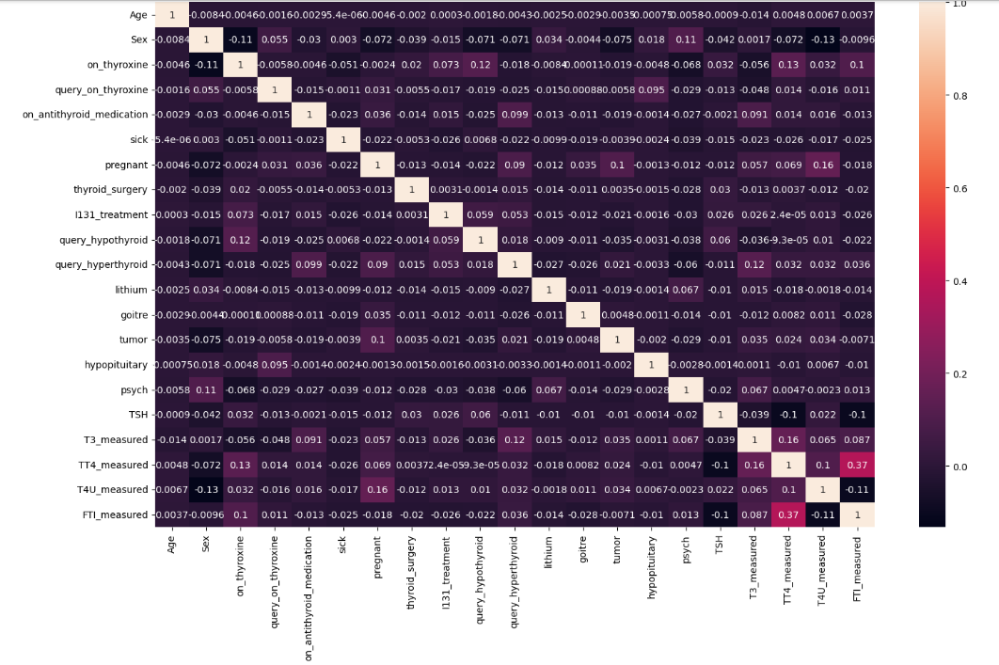

# Thyroid Disease Exploratory Data Analysis (EDA)

## Project Overview

This project focuses on performing **Exploratory Data Analysis (EDA)** on a Thyroid dataset to understand the patterns, distributions, and relationships between different patient features.

The main goal of this project is to analyze thyroid-related information, clean the data, visualize important features, and extract meaningful insights using Python.

---

## Dataset

Dataset Source:
Kaggle Thyroid Dataset

The dataset contains patient information including:

- Age
- Gender
- Thyroid medication details
- Medical history
- Thyroid hormone measurements
- TSH levels
- T3 and T4 measurements
- Outlier label

---

## Objectives

The objectives of this project are:

- Understand the structure of the dataset
- Perform data cleaning
- Handle missing values
- Analyze numerical and categorical features
- Visualize important patterns
- Identify relationships between thyroid features

---

## Technologies Used

- Python
- Pandas
- NumPy
- Matplotlib
- Seaborn
- Jupyter Notebook

---

## Project Workflow

### 1. Data Loading

- Imported dataset using Pandas
- Checked initial rows and dataset structure

### 2. Data Understanding

Performed:

- Shape analysis
- Data type checking
- Statistical summary
- Unique value analysis

### 3. Data Cleaning

Performed:

- Missing value analysis
- Duplicate checking
- Data preparation for analysis

### 4. Exploratory Data Analysis

Performed analysis using:

- Univariate analysis
- Distribution plots
- Count plots
- Box plots
- Correlation analysis

---

## Visualizations Created

### Age Distribution

Analyzed patient age distribution to understand the demographic pattern.

### Gender Distribution

Studied the distribution of patients based on gender.

### Outlier Label Distribution

Analyzed the target variable to understand normal and outlier cases.

### Thyroid Hormone Analysis

Studied the distribution of:

- TSH
- T3
- T4
- FTI measurements

### Correlation Analysis

Used correlation heatmap to understand relationships between numerical features.

---

## Key Insights

- Explored patient demographic patterns.
- Analyzed thyroid hormone level distributions.
- Identified relationships between important numerical features.
- Studied differences between normal and outlier cases.

---

## Project Structure

```
Thyroid-EDA/
│
├── README.md
│
├── Thyroid_EDA.ipynb
│
├── dataset/
│   └── thyroid.csv
│
└── images/
    └── visualizations.png
```

---

## Conclusion

This project helped me understand the complete EDA process, including data exploration, cleaning, visualization, and extracting insights from healthcare-related data.

It strengthened my understanding of using Python for Data Analysis and prepared me for more advanced Data Science projects.

---

## Visualizations

### Dataset Preview


### Outlier Distribution


### TSH Distribution


### Correlation Heatmap

---

## Author

Ram Badgujar

B.Tech Data Science Engineering Student

Skills:
Python | SQL | Data Analysis | Machine Learning