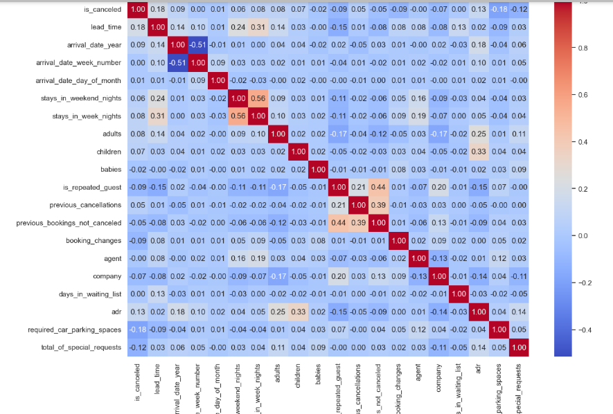

# 🏨 Hotel Booking Business Intelligence - Exploratory Data Analysis (EDA)

## 📌 Project Overview

This project performs an Exploratory Data Analysis (EDA) on the **Hotel Booking Business Intelligence** dataset to uncover patterns in hotel reservations, customer behavior, booking cancellations, pricing, and seasonal trends.

The objective is to transform raw booking data into meaningful business insights that can help hotel management improve occupancy, reduce cancellations, and optimize revenue.

---

## 🎯 Business Objectives

- Analyze booking trends across hotel types.
- Identify factors influencing booking cancellations.
- Understand customer demographics and booking behavior.
- Analyze seasonal demand for hotel bookings.
- Explore pricing trends using Average Daily Rate (ADR).
- Provide actionable business recommendations.

---

## 📂 Dataset Information

- **Dataset:** Hotel Booking Demand
- **Records:** ~119,000
- **Features:** 32
- **Type:** Structured CSV
- **Domain:** Hospitality / Hotel Management

---

## 🛠️ Technologies Used

- Python
- Pandas
- NumPy
- Matplotlib
- Seaborn
- Jupyter Notebook

---

## 📊 Exploratory Data Analysis

The analysis includes:

### Data Understanding
- Dataset overview
- Data types
- Shape
- Summary statistics
- Unique values

### Data Cleaning
- Missing value treatment
- Duplicate removal
- Data type verification

### Univariate Analysis
- Distribution of numerical variables
- Frequency distribution of categorical variables
- Outlier detection

### Bivariate Analysis
- Booking cancellation by hotel type
- ADR by customer type
- Lead time vs ADR
- Customer type analysis
- Market segment analysis

### Multivariate Analysis
- Correlation matrix
- Feature relationships
- Business trend analysis

---

## 📈 Key Visualizations

- Histogram
- Box Plot
- Count Plot
- Bar Plot
- Scatter Plot
- Violin Plot
- Correlation Heatmap
- Pair Plot

---

## 🔍 Key Insights

- Identified booking cancellation patterns.
- Compared booking behavior between City Hotels and Resort Hotels.
- Analyzed seasonal booking demand.
- Explored customer segments and booking channels.
- Investigated pricing trends using ADR.
- Examined relationships between booking lead time and cancellations.

---

## 💼 Business Recommendations

- Implement targeted strategies to reduce booking cancellations.
- Optimize room pricing during high-demand seasons.
- Focus marketing efforts on high-value customer segments.
- Improve occupancy during off-peak periods through promotional offers.
- Enhance booking management using customer behavior insights.

---

## 📁 Project Structure

```
Hotel Booking Business Intelligence/
│
├── Hotel_Booking_EDA.ipynb
├── hotel_bookings.csv
├── README.md
├── requirements.txt
└── images/
```

---

## 🚀 Skills Demonstrated

- Data Cleaning
- Exploratory Data Analysis (EDA)
- Data Visualization
- Statistical Analysis
- Business Insight Generation
- Data Storytelling

---

## 📷 Sample Visualizations

## 📊 Boxplot of Lead Time


---

## 📊 Cancellation By Hotel Type


---

## 📊 Customer Type


---

## 📊 Distribution Of Lead Time


---

## 📊 Correlation Heatmap



---

## 📊 Lead Time vs ADR


---

## 📌 Future Improvements

- Build an interactive Power BI dashboard.
- Perform customer segmentation.
- Develop a booking cancellation prediction model.
- Analyze revenue trends using advanced analytics.

---

## 👨‍💻 Author

**Ram Badgujar**

B.Tech Data Science Student

Interested in:
- Data Analytics
- Business Intelligence
- Data Visualization
- Machine Learning

---

## ⭐ If you found this project useful, consider giving it a star!